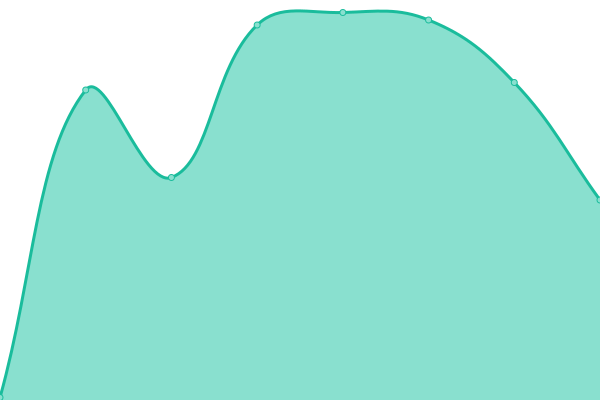
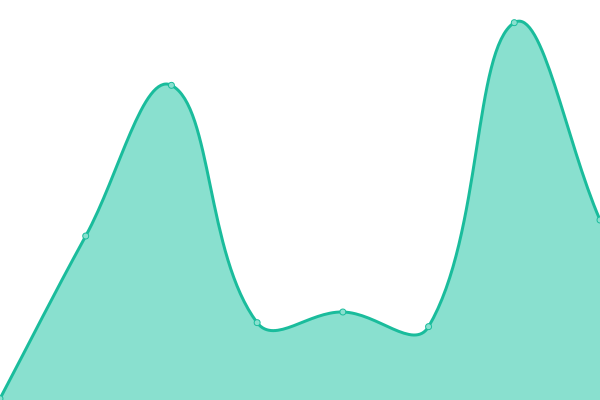

# [📈 Live Status](https://lu4ult.github.io/upptime): <!--live status--> **🟧 Partial outage**

This repository contains the open-source uptime monitor and status page for [Lautaro Tourn - LU4ULT](https://lu4ult.com), powered by [Upptime](https://github.com/upptime/upptime).

With [Upptime](https://upptime.js.org), you can get your own unlimited and free uptime monitor and status page, powered entirely by a GitHub repository. We use [Issues](https://github.com/lu4ult/upptime/issues) as incident reports, [Actions](https://github.com/lu4ult/upptime/actions) as uptime monitors, and [Pages](https://lu4ult.github.io/upptime) for the status page.

<!--start: status pages-->
<!-- This summary is generated by Upptime (https://github.com/upptime/upptime) -->
<!-- Do not edit this manually, your changes will be overwritten -->
<!-- prettier-ignore -->
| URL | Status | History | Response Time | Uptime |
| --- | ------ | ------- | ------------- | ------ |
|  [LU4ULT](https://lu4ult.com) | 🟩 Up | [lu-4-ult.yml](https://github.com/lu4ult/upptime/commits/HEAD/history/lu-4-ult.yml) | 

 148ms
     
 | 

<a href="https://lu4ult.github.io/upptime/history/lu-4-ult">100.00%</a>
    

|  [Tenes stock?](https://friendly-bublanina-3c840e.netlify.app/) | 🟥 Down | [tenes-stock.yml](https://github.com/lu4ult/upptime/commits/HEAD/history/tenes-stock.yml) | 

 77ms
     
 | 

<a href="https://lu4ult.github.io/upptime/history/tenes-stock">0.00%</a>
    

|  [Monitor Serie Web](https://playful-paletas-599515.netlify.app/) | 🟩 Up | [monitor-serie-web.yml](https://github.com/lu4ult/upptime/commits/HEAD/history/monitor-serie-web.yml) | 

 132ms
     
 | 

<a href="https://lu4ult.github.io/upptime/history/monitor-serie-web">100.00%</a>
    

|  [Afip](https://www.afip.gob.ar/landing/default.asp) | 🟩 Up | [afip.yml](https://github.com/lu4ult/upptime/commits/HEAD/history/afip.yml) | 

 1437ms
     
 | 

<a href="https://lu4ult.github.io/upptime/history/afip">98.43%</a>
    

|  [Afip Login](https://auth.afip.gob.ar/contribuyente_/login.xhtml) | 🟩 Up | [afip-login.yml](https://github.com/lu4ult/upptime/commits/HEAD/history/afip-login.yml) | 

 2355ms
     
 | 

<a href="https://lu4ult.github.io/upptime/history/afip-login">98.35%</a>
    

|  [Instagram](https://www.instagram.com/) | 🟩 Up | [instagram.yml](https://github.com/lu4ult/upptime/commits/HEAD/history/instagram.yml) | 

 461ms
     
 | 

<a href="https://lu4ult.github.io/upptime/history/instagram">100.00%</a>
    

<!--end: status pages-->

[**Visit our status website →**](https://lu4ult.github.io/upptime)

## 📄 License

- Powered by: [Upptime](https://github.com/upptime/upptime)
- Code: [MIT](./LICENSE) © [Lautaro Tourn - LU4ULT](https://lu4ult.com)
- Data in the `./history` directory: [Open Database License](https://opendatacommons.org/licenses/odbl/1-0/)
